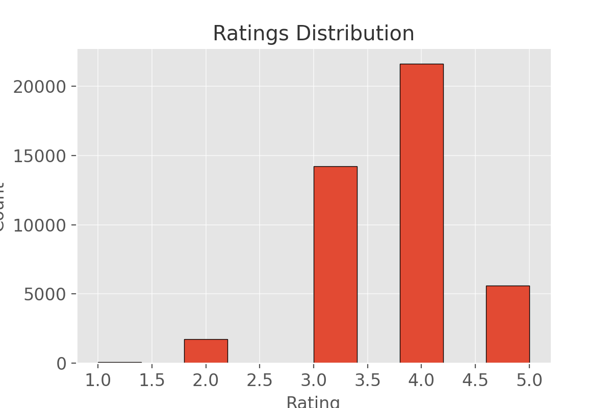
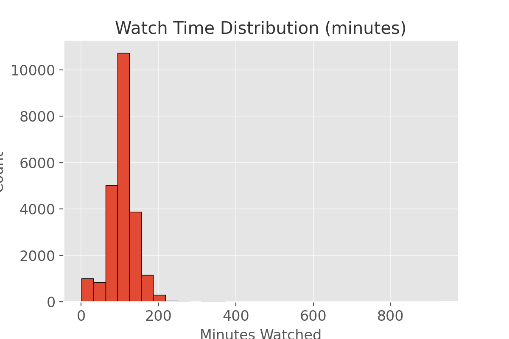
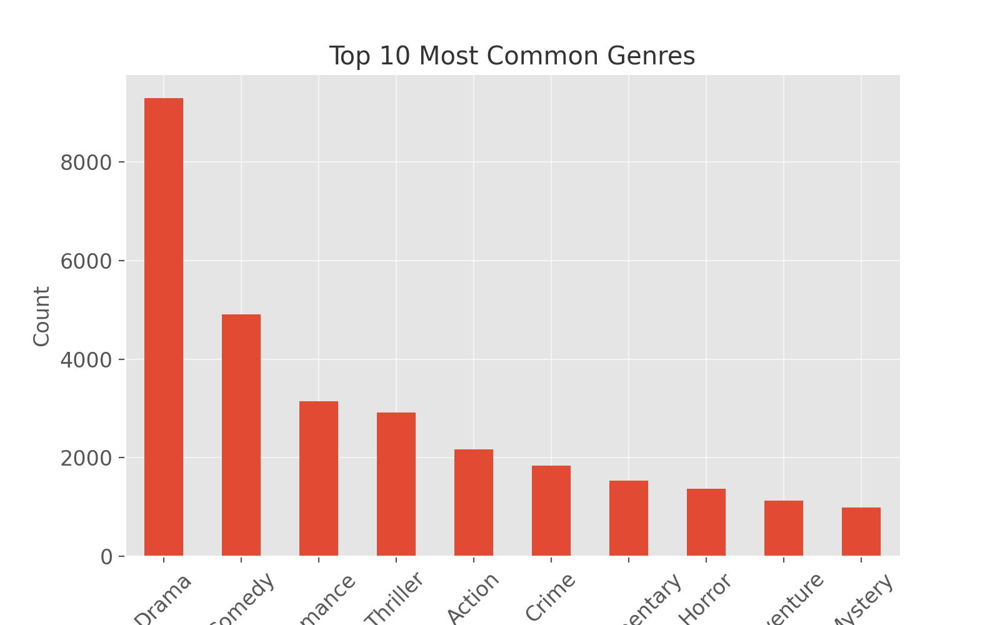

## Data Collection and Statistics

This project uses simulated streaming service logs provided through the Apache Kafka logs
`docker run -it --log-opt max-size=50m --log-opt max-file=5 bitnami/kafka kafka-console-consumer.sh --bootstrap-server fall2025-comp585.cs.mcgill.ca:9092 --topic movielog6`

The logs contain information about:
- **Watch activity**: when a user watches a movie (by minute segments).
- **User metadata**: retrieved from the `/user/<id>` API endpoint.
- **Movie metadata**: retrieved from the `/movie/<id>` API endpoint.
- **Ratings**: extracted from `/rate/<movieid>=<rating>` events in the logs.

We extract the `user_id`, `movie_id` and `watch_time` information from the logs.

We implemented a **`DataDownloader`** utility to:
1. Parse the raw Kafka logs (`event_stream.log`).
2. Saves watch-time interaction to `watch_time.csv`.
3. Extract **unique user IDs** and **movie IDs**.
4. Query the provided API to fetch **user metadata** and **movie metadata**, saving them as CSV/JSON.
5. Collect explicit ratings from logs using into `ratings.csv`.

## Data Sources
- **Users**
  - Extracted from `/user/<id>` endpoint.
  - Stored in `users.csv`.
  - Each row includes: `user_id`, `age`, `occupation`, `gender`.

- **Movies**
  - Extracted from `/movie/<id>` endpoint.
  - Raw JSONs stored in `movies/` folder.
  - Flattened features stored in `movies.csv` (includes runtime, popularity, genres, languages, etc.).

- **Ratings**
  - Extracted from `GET /rate/...` log events.
  - Stored in `ratings.csv` as `user_id`, `movie_id`, `rating`.

- **Watch Time**
  - Extracted from `GET /data/m/...` log events.
  - Stored in `watch_time.csv` as `user_id`, `movie_id`, `minutes_watched`.

## Dataset Statistics

- **Users:** 111930
- **Movies:** 16960
- **Ratings:** 43231 (avg rating = 3.72)
- **Watch Time Records:** 23025 (avg minutes watched = 106.25)
- **Most Common Occupation:** college/grad student
- **Most Common Genre:** Drama

### Distributions & Figures

#### Ratings Distribution
Most ratings cluster around the mid-to-high range (3–5). This suggests that users are generally positive when they rate, but it also introduces a bias — fewer negative ratings mean the model learns stronger signals from positive preferences.

#### Watch Time Distribution
The majority of watch sessions are short, with a long tail of full-movie watches. This implies that using watch time as implicit feedback requires thresholds (e.g., >50% watched = positive) to avoid noise from abandoned views.

#### Top 10 Most Common Genres
Drama and Comedy dominate the dataset, followed by Thriller and Action. Less frequent genres (e.g., Western, Musical) are underrepresented, which could lead to sparsity issues for recommendations involving those categories.

#### User Age Distribution
Most users fall within the `19–25` and `26–35` ranges, making the dataset skewed toward younger audiences. This concentration may bias the recommender towards preferences of younger demographics unless explicitly balanced.

